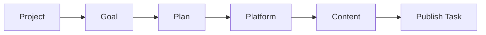

# fgeo

fgeo is a local CLI for building and operating an AI-assisted go-to-market
content system.

It is designed for product builders who have working software, domain knowledge,
and messy launch intent, but do not want promotion work to become a second job.
fgeo gives the AI agent a structured operating model:



## What fgeo Solves

Most AI content work falls apart after the first draft:

| Problem | How fgeo helps |
| --- | --- |
| No shared content state | Store projects, plans, platforms, content, and publishing state in `~/.fgeo/`. |
| Platform context is scattered | Track each platform's directions, pace, credentials, and publishing metadata. |
| AI writes before strategy is clear | Agent instructions enforce consult, confirm, then execute. |
| Drafts are hard to connect to goals | Register every content asset against project, platform, plan, and direction. |
| Publishing is manual glue work | `fgeo publish content <id>` routes to the right platform publisher. |

## How It Works With Agents

Run:

```bash
fgeo enable copilot
```

fgeo writes agent instructions for the current workspace and delegates shared
context setup to fcontext. The agent can then use fgeo commands when the user
asks about content creation, GEO, SEO, publishing, launch planning, or promotion.

Supported agents include Copilot, Claude, Cursor, Trae, Qwen, Kiro, OpenCode,
OpenClaw, Zed, Pi, AntiGravity, and Codex.

## Publishing Targets

fgeo can publish or prepare publish tasks for:

- blog repositories
- Medium
- WeChat official account
- Bluesky
- DEV.to
- Juejin articles
- Juejin pins

For unsupported platforms, fgeo can still track the content and sync published
status manually.

## Next Steps

- [Getting Started](getting-started.md)
- [GTM Workflow](workflows/gtm.md)
- [Command Reference](commands.md)

